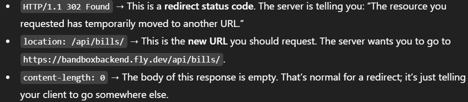
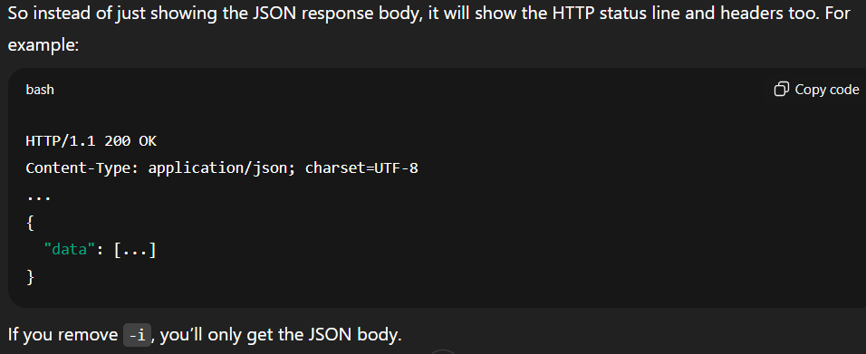
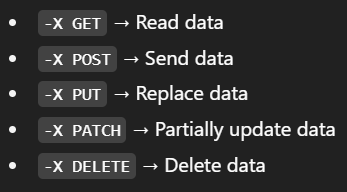

# 🔧 Band Box Backend – Django REST API for Drycleaning App

This is the **backend API** for the [Band Box Drycleaners](https://github.com/rahules24/bandboxdrycleaners) project. It manages orders, billing, and user authentication for a local dry cleaning business, built with **Django** and **Django REST Framework**, using **PostgreSQL** for data storage.

---

# Local Development

### 1. Setup ```.env```
- Use the same credentials while running the database container

### 2. Run the database container
- ```\bandboxdb>``` Run the docker image to start the local PostgreSQL database

### 3. Run Migrations
- Create tables in the connected databse:
    ```
    \bandboxbackend> python manage.py makemigrations
    \bandboxbackend> python manage.py migrate
    ```

### 4. Run backend server
- ```\bandboxbackend> python manage.py runserver```


---

# Production

### 1. Generate secret key
```
\user> python -c "from django.core.management.utils import get_random_secret_key; print(get_random_secret_key())"
```
### 2. Set secrets on fly.io using terminal
- From directory containing fly.toml (app = 'bandboxbackend')
```
\bandboxbackend> flyctl secrets set KEY="value"
```
- Pass app name explicitly
```
\user> flyctl secrets set KEY="value" -a bandboxbackend
```

#### 3. Set following secrets
```
flyctl secrets set SECRET_KEY=""
flyctl secrets set DEBUG=False
flyctl secrets set DATABASE_URL="postgres://db_user:db_password@db_host:5432/db_name"
flyctl secrets set ALLOWED_HOSTS="bandboxbackend.fly.dev,rahules24.github.io"
flyctl secrets set CORS_ALLOWED_ORIGINS="https://rahules24.github.io"
flyctl secrets set CSRF_TRUSTED_ORIGINS="https://bandboxbackend.fly.dev"
```
### 4. Re-deploy bandboxbackend
```
\bandboxbackend> flyctl deploy -a bandboxbackend
```

### 5. Test API by sending a GET request
- ```curl https://bandboxbackend.fly.dev/```

#### If response body is empty, get response headers
- ```curl -i https://bandboxbackend.fly.dev/```
  - ```-i``` shows the response headers along with the body. 
```
HTTP/1.1 302 Found
location: /api/bills/
content-length: 0
```


#### ```curl``` by default does not follow redirects automatically
- use: ```curl -s -L https://bandboxbackend.fly.dev/ | jq```
  - ```-s```  Silent mode (hides progress and extra info).
  - ```-L```  Follow redirects automatically.
  - ``` | jq```  Pipes the output into jq, a tool to pretty-print JSON
  - ```-u username:password``` Sends credentials in base64 encoding.

---
# Graph API
### Meta's WhatsApp Business Account (WABA) API
- Visit: [Graph API Explorer](https://developers.facebook.com/tools/explorer)
### API Calls
- Endpoints:
  - ```"https://graph.facebook.com/v22.0/<PHONE_NUMBER_ID>/whatsapp_business_profile/"  -H "Authorization: Bearer <ACCESS_TOKEN>"```
  - ```"https://graph.facebook.com/v22.0/<BUSINESS_ACCOUNT_ID>/message_templates" -H "Authorization: Bearer <ACCESS_TOKEN>"```

- GET Requests
  - ```metadata=1``` query returns a full metadata object that lists all the fields on the WhatsApp Business Phone Number.
  
      - ```curl "https://graph.facebook.com/v23.0/<PHONE_NUMBER_ID>?metadata=1" -H "Authorization: Bearer YOUR_ACCESS_TOKEN"```

      - ```curl "https://graph.facebook.com/v23.0/<WABA_ID>?metadata=1" -H "Authorization: Bearer YOUR_ACCESS_TOKEN"```
    
      - ```curl "https://graph.facebook.com/v22.0/<PHONE_NUMBER_ID/whatsapp_business_profile?metadata=1" \ -H "Authorization: Bearer YOUR_ACCESS_TOKEN"```
      
        - **Output:** ```{"data":[{"messaging_product":"whatsapp"}]}```
        - WhatsApp Business Profile object doesn’t expose a fields array through metadata=1

  - You need to specify what fields you want to _get._ there ain't no '_get all_' or _'?fields=*'_ kinda endpoint: ```\user> curl -X GET "https://graph.facebook.com/v22.0/<PHONE_NUMBER_ID>/whatsapp_business_profile?fields=about,address,description,websites,vertical" -H "Authorization: Bearer <ACCESS_TOKEN>"```
  - Save response in a json file:
    ```
    \user> curl -X GET "https://graph.facebook.com/v19.0/<PHONE_NUMBER_ID>/whatsapp_business_profile?fields=about,address,description,email,websites" `
    -H "Authorization: Bearer <ACCESS_TOKEN>" `
    -o "C:\path\to\response.json"
    ```
  - ```curl``` Flags
    - ```-i``` includes the HTTP response headers in the output: ```curl -i -X GET "https://graph.facebook.com/v23.0/```
      
    - Saving Response in file:
      - Save both headers and body separately: ```curl -D headers.txt -o body.json "URL"```
      - Include headers in the same file as the body: ```curl -i -o full_response.txt "URL"```
      - ```-o <file_name.ext>``` saves response body (only) to file.
      - ```-D <file_name.ext>``` saves response headers (only) to file.

- POST Requests
  - ```{"messaging_product": "whatsapp"}``` The parameter messaging_product is required. You need to always send it in json while making a POST request.
    ```
    curl -X POST "https://graph.facebook.com/v19.0/<PHONE_NUMBER_ID>/whatsapp_business_profile" `
    -H "Authorization: Bearer <TOKEN>"
    -H "Content-Type: application/json"
    -d '{"messaging_product": "whatsapp", "key1": "vlaue1", "key2": "vlaue2"}'
    ```
   
  - Send json file as payload:
    ```
    \user> curl -X POST "https://graph.facebook.com/v19.0/<PHONE_NUMBER_ID>/whatsapp_business_profile" `
    -H "Authorization: Bearer <ACCESS_TOKEN>" `
    -H "Content-Type: application/json" `
    -d (Get-Content -Raw -Path "C:\path\to\profile.json")
    ```

  - ```curl``` Flags
      - ```-X``` tells curl which request method to use. It overrides HTTP method.
        - By default, curl uses GET.
          
          
      - ```-d``` | ```--data``` sends data in the body of the request.
        
            ```
              curl -X POST https://api.example.com/items `
              -H "Content-Type: application/json" `
              -d '{"name": "Widget", "price": 9.99}'
            ```
      

- Authentication
    1. ```?access_token=<TOKEN>```: Sends the token as a query parameter in the URL.
        - Example: ```https://graph.facebook.com/v23.0/833155156543248/message_history?access_token=EAA...```
        - This is less secure, since URLs can be logged or cached in servers, browser history, etc.

    2. ```-H "Authorization: Bearer <TOKEN>"```: Sends the token in an HTTP header, specifically the Authorization header.
        - This is the recommended and more secure method, since the token is not exposed in the URL.


---

## 📦 Tech Stack

- **Framework:** Django, Django REST Framework (DRF)
- **Database:** PostgreSQL
- **Authentication:** Django's built-in auth system (with optional token/session support)
- **API:** RESTful endpoints for orders, billing, and users
- **Hosting:** [Fly.io](https://fly.io/)

---

## 📁 Project Structure

```
bandboxbackend/
├── bandbox/              # Django project config
├── orders/               # Orders app (models, serializers, views)
├── manage.py
├── requirements.txt
└── README.md
```

---

## 📌 Core Features

- 🧾 Order creation and billing logic
- 📊 API endpoints for managing services and pricing
- 🔐 Admin and staff login (customizable roles)
- 🧩 Designed to connect with the React frontend via REST
- 📱 WhatsApp notifications for contact form submissions

---

## 🌐 Related Repositories

- **Frontend App:** [Band Box Drycleaners (React TypeScript)](https://github.com/rahules24/bandboxdrycleaners)